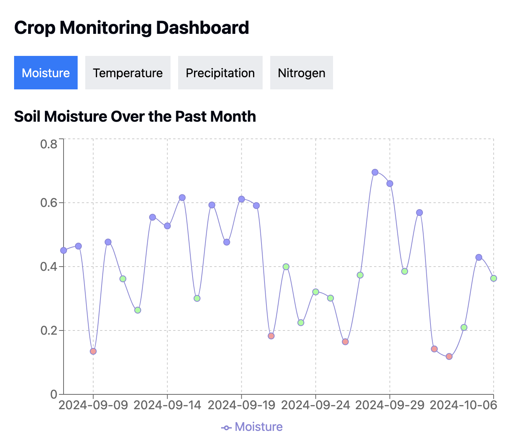

# Error404-Gravity-Not-Found
Here we are, our repo of the NASA hackathon app challenge 2024 GBG!

# Project Contributors
Peiran Wei (Commited code and additional functionality to repository)
Cui Zizhuang (Worked in local environment, shared with team in Discord)
Adelric Wong (Worked in local environment, shared with team in Discord)
Xiang Xu (Commited code and additional functionality to repository)
Mengting Wang (Worked in local environment, shared with team in Discord)


## High-Level Summary
We are developing an application that enables farmers to understand in a simple manner key aspects of agriculture which impacts the health of their crops and conditions of their soil.

## Project Demo
[Web App Demo](https://youtu.be/NkQ4t4_k3aY)


## Final Project
https://github.com/Peiran-Wei/Error404-Gravity-Not-Found

## Project Details
Using React, UI Components. Our application enables farmers to have a simple understanding of their soil data and the surrounding environmental conditions that affect the health of their land without all the complexities of processing or interpreting large datasets which if the everyday individual looks at that and does not understand, how can they farmers be expected to understand? We keep things simple and intuitive.

## Use of Artificial Intelligence
We used Claude.ai to get examples of what data we can get from APIs, process the data without having to go through entire large datasets and visualizing the data in combination with the thought process we have with the idea, editing and modifying conditions we determined were irrelevant and adding information that adds better usability.

## Space Agency Data
* [NASA SMAP (Soil Moisture Active Passive)](https://smap.jpl.nasa.gov/)
* [Copernicus Global Land Service](https://land.copernicus.eu/en)
* [SMOS (Soil Moisture and Ocean Salinity)](https://earth.esa.int/eogateway/missions/smos)
* [EUMETSAT H SAF](https://www.eumetsat.int/h-saf)

# Getting Started with Create React App

This project was bootstrapped with [Create React App](https://github.com/facebook/create-react-app).

## Available Scripts

In the project directory, you can run:

### ```npm start```

Runs the app in the development mode.\
Open [http://localhost:3000](http://localhost:3000) to view it in your browser.

The page will reload when you make changes.\
You may also see any lint errors in the console.

### ```npm test```

Launches the test runner in the interactive watch mode.\
See the section about [running tests](https://facebook.github.io/create-react-app/docs/running-tests) for more information.

### ```npm run build```

Builds the app for production to the `build` folder.\
It correctly bundles React in production mode and optimizes the build for the best performance.

The build is minified and the filenames include the hashes.\
Your app is ready to be deployed!

See the section about [deployment](https://facebook.github.io/create-react-app/docs/deployment) for more information.

### ```npm run eject```

**Note: this is a one-way operation. Once you `eject`, you can't go back!**

If you aren't satisfied with the build tool and configuration choices, you can `eject` at any time. This command will remove the single build dependency from your project.

Instead, it will copy all the configuration files and the transitive dependencies (webpack, Babel, ESLint, etc) right into your project so you have full control over them. All of the commands except `eject` will still work, but they will point to the copied scripts so you can tweak them. At this point you're on your own.

You don't have to ever use `eject`. The curated feature set is suitable for small and middle deployments, and you shouldn't feel obligated to use this feature. However we understand that this tool wouldn't be useful if you couldn't customize it when you are ready for it.

## Learn More

You can learn more in the [Create React App documentation](https://facebook.github.io/create-react-app/docs/getting-started).

To learn React, check out the [React documentation](https://reactjs.org/).

### Code Splitting

This section has moved here: [https://facebook.github.io/create-react-app/docs/code-splitting](https://facebook.github.io/create-react-app/docs/code-splitting)

### Analyzing the Bundle Size

This section has moved here: [https://facebook.github.io/create-react-app/docs/analyzing-the-bundle-size](https://facebook.github.io/create-react-app/docs/analyzing-the-bundle-size)

### Making a Progressive Web App

This section has moved here: [https://facebook.github.io/create-react-app/docs/making-a-progressive-web-app](https://facebook.github.io/create-react-app/docs/making-a-progressive-web-app)

### Advanced Configuration

This section has moved here: [https://facebook.github.io/create-react-app/docs/advanced-configuration](https://facebook.github.io/create-react-app/docs/advanced-configuration)

### Deployment

This section has moved here: [https://facebook.github.io/create-react-app/docs/deployment](https://facebook.github.io/create-react-app/docs/deployment)

### `npm run build` fails to minify

This section has moved here: [https://facebook.github.io/create-react-app/docs/troubleshooting#npm-run-build-fails-to-minify](https://facebook.github.io/create-react-app/docs/troubleshooting#npm-run-build-fails-to-minify)
